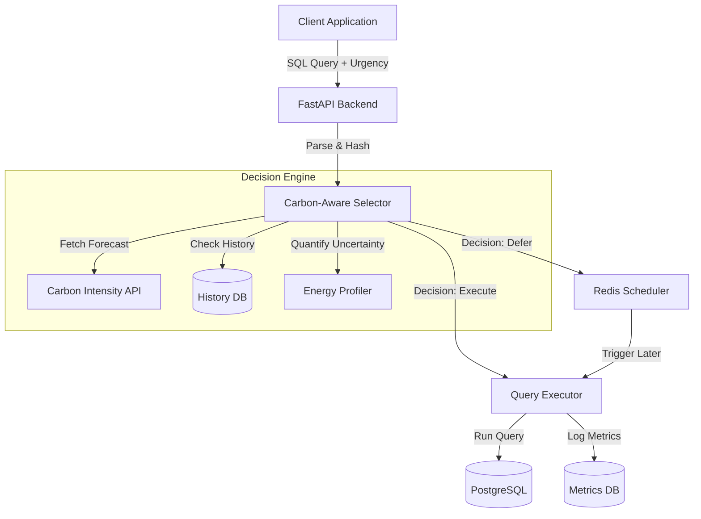

# 🌱 Carbon-Aware SQL Engine
### *Optimizing Database Queries for a Greener Future*

---

## 📖 Abstract & Impact

The **Carbon-Aware SQL Engine** is a novel database middleware that intelligently schedules SQL query execution based on real-time grid carbon intensity. By integrating **uncertainty quantification** into the decision-making process, this system minimizes the carbon footprint of data operations without compromising critical performance requirements.

**Key Contributions:**
*   **Carbon-Aware Selector:** A robust decision engine that defers non-urgent queries during high-carbon periods.
*   **Uncertainty Quantification:** Incorporates forecast uncertainty ($I$) and energy consumption variability ($\sigma$) to make conservative, reliable scheduling decisions.
*   **Multi-Strategy Execution:** Dynamically selects between "Fast", "Balanced", and "Efficient" execution plans based on environmental context.

---

## 🏗️ System Architecture

The system operates as a middleware layer between the client application and the database.



---

## 🔬 The Research Contribution: Uncertainty Metrics

This project advances the state of the art by explicitly modeling uncertainty in carbon-aware scheduling.

### 1. Forecast Uncertainty ($I$)
We utilize a 95% confidence interval for carbon intensity forecasts. The decision logic conservatively uses the lower bound of the forecast to avoid false positives in deferral decisions.

$$ CI_{forecast} - I_{uncertainty} > Threshold \Rightarrow \text{Defer} $$

### 2. Energy Variability ($\sigma$)
Energy consumption is not static. We profile queries to calculate the standard deviation ($\sigma$) of energy usage, providing a reliability metric for our emissions estimates.

### Benchmarking
To reproduce our results and view these metrics:

```bash
# Run the benchmarking suite
python benchmarks/run_tests.py
```

The results will populate the database and can be visualized in the dashboard.

---

## 🚀 Getting Started

### Prerequisites
*   Docker & Docker Compose
*   Python 3.9+

### Quick Start

1.  **Clone the repository**
    ```bash
    git clone https://github.com/yourusername/energy-ml-project.git
    cd energy-ml-project
    ```

2.  **Configure Environment**
    Copy `.env.example` to `.env` and add your API keys.
    ```bash
    cp .env.example .env
    ```

3.  **Launch System**
    ```bash
    docker-compose up -d
    ```

4.  **Access Dashboard**
    Navigate to `http://localhost:8501` to view the UI and execute queries.

---

## 📚 Documentation

*   [Deployment Guide](DEPLOYMENT_GUIDE.md): Instructions for deploying to Render and Streamlit Cloud.
*   [API Documentation](http://localhost:8000/docs): Swagger UI for the backend API.

---

## 📄 License

This project is licensed under the MIT License - see the [LICENSE](LICENSE) file for details.
